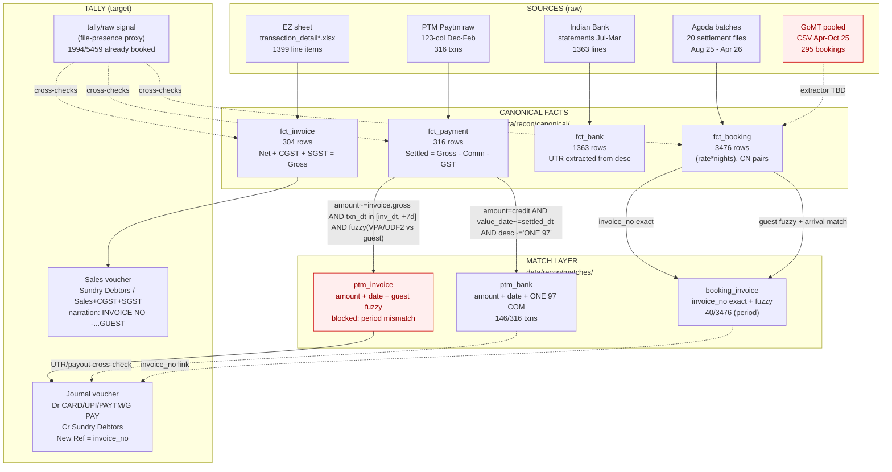

# Recon flow + ER

## Narration in `data/tally/raw/`?

Inspected — **none of the 30 tally-bucket files carry narration columns.**
They are byte-identical (or cosmetic-diff) copies of the same Agoda settlement
sheets, PTM dumps, and bank statements that live in `booking/processed/` and
`payments/processed/`. There is no Tally Day Book / Voucher export in this
bundle. So the narrations Urvashi enters in Tally are **constructed** from
input columns; we have to rebuild them in the ETL.

The two narration templates seen in the meeting screenshots:

```
Sales voucher (per invoice):
   "INVOICE NO -<25-26/####> <GUEST NAME UPPERCASED>"
   ← built from EZ:  Invoice # → 25-26/####
                     Guest Name (upper)

Journal voucher (per payment, when matched to an invoice):
   "BEING PAID THROUGH <MODE> AGAINST INVOICE NO:<25-26/####> <GUEST>"
   ← built from PTM: Payment_Mode (UPI/CREDIT_CARD/UPI_CC)
                     matched invoice_no
                     pos_guest_name (UDF2) or matched invoice's Guest Name
```

Reverse-engineering for the matcher: the `INVOICE NO:<25-26/####>` token in
a real Tally narration would be the reliable bridge from Tally Journal back
to EZ invoice — but we never received that real Tally export.

---

## End-to-end recon flow (mermaid)



---

## ER: keys + cardinalities

```
                                EZ                                    Agoda
                          ┌────────────┐                       ┌────────────────┐
                          │ Invoice #  │                       │ agoda_booking_id│
                          │ Folio #    │                       │ invoice_no list │
                          │ Reservation│                       │ rate*nights     │
                          │ Guest Name │   travel_agent_       │ guest_name      │
                          │ Bill To    │  voucher cross-link   │ checkin/checkout│
                          └─────┬──────┘ ←──── (sparse) ────── └─────┬──────────┘
                                │                                    │
                                │ 1:1 folio↔invoice (this dump)      │ 1 booking → ≥1 invoice
                                │                                    │ (rate-change CN pair)
                                ▼                                    ▼
                          ┌──────────────────────────────────────────────┐
                          │              fct_invoice (304)               │
                          │ invoice_no • invoice_date • guest • travel_  │
                          │ agent • net • cgst • sgst • gross • channel  │
                          └──────────────────┬───────────────────────────┘
                                             │ inv.invoice_no
                                             │  (matched)
                       ┌─────────────────────┼──────────────────────┐
                       │                     │                      │
                  ┌────┴───────┐      ┌──────┴────────┐       ┌─────┴────────┐
                  │ fct_payment │ many │ fct_bank      │       │ fct_booking  │
                  │ (PTM, 316)  │  to  │ (1363)        │       │ (Agoda, 3476)│
                  │             │ many │               │       │              │
                  │ txn_id PK   │←─────┤ ref_no/utr_   │       │ booking_id   │
                  │ payout_id   │ amt+ │ extracted     │       │ invoice_no   │
                  │ utr (paytm) │ date │ value_date    │       │ guest_name   │
                  │ amount_gross│ ────►│ credit/debit  │       │ checkin      │
                  │ commission  │      │ description   │       │ rate*nights  │
                  │ gst (18%)   │      │ (NEFT/UTR)    │       │ comm+gst     │
                  │ settled_amt │      └───────────────┘       │ credit_note  │
                  │ payment_mode│                              └──────────────┘
                  │ utr,rrn     │
                  │ pos_guest   │
                  └─────────────┘
                          ▲
                          │ join keys (priority order)
                          │
      ┌───────────────────┴───────────────────────────────────────┐
      │ 1. UTR / Paytm payout: PTM ⊕ batch → bank credit          │
      │    (Paytm UTR ≠ NEFT UTR — link is amount + date + narr.) │
      │                                                            │
      │ 2. Amount + date window:                                   │
      │    PTM.amount_gross ≈ Invoice.gross                        │
      │    AND inv_date ≤ txn_dt ≤ inv_date + 7d                   │
      │                                                            │
      │ 3. Guest fuzzy:                                            │
      │    PTM.UDF2 (LASTNAME/FIRSTNAME) or VPA-handle             │
      │    fuzz.token_set_ratio(EZ.guest_name) ≥ 80                │
      │                                                            │
      │ 4. Booking → Invoice:                                      │
      │    Agoda.booking_id = EZ.travel_agent_voucher              │
      │    (sparse) OR guest+arrival fuzzy                         │
      │                                                            │
      │ 5. PDF receipt invoice_no — UNAVAILABLE                    │
      │    (LIC PDFs were misclassified, real ones never delivered)│
      └───────────────────────────────────────────────────────────┘
```
